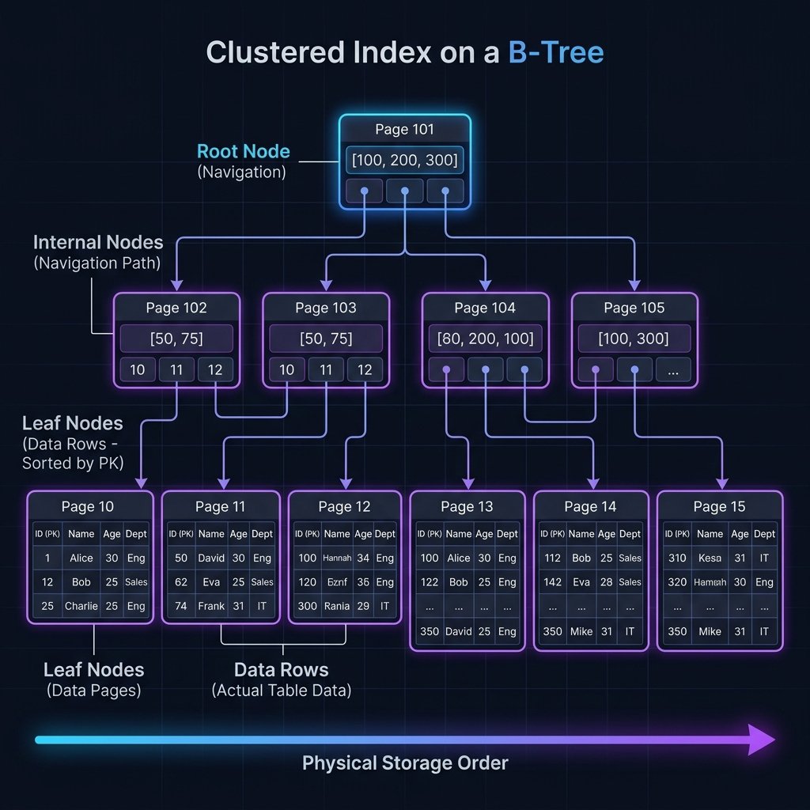
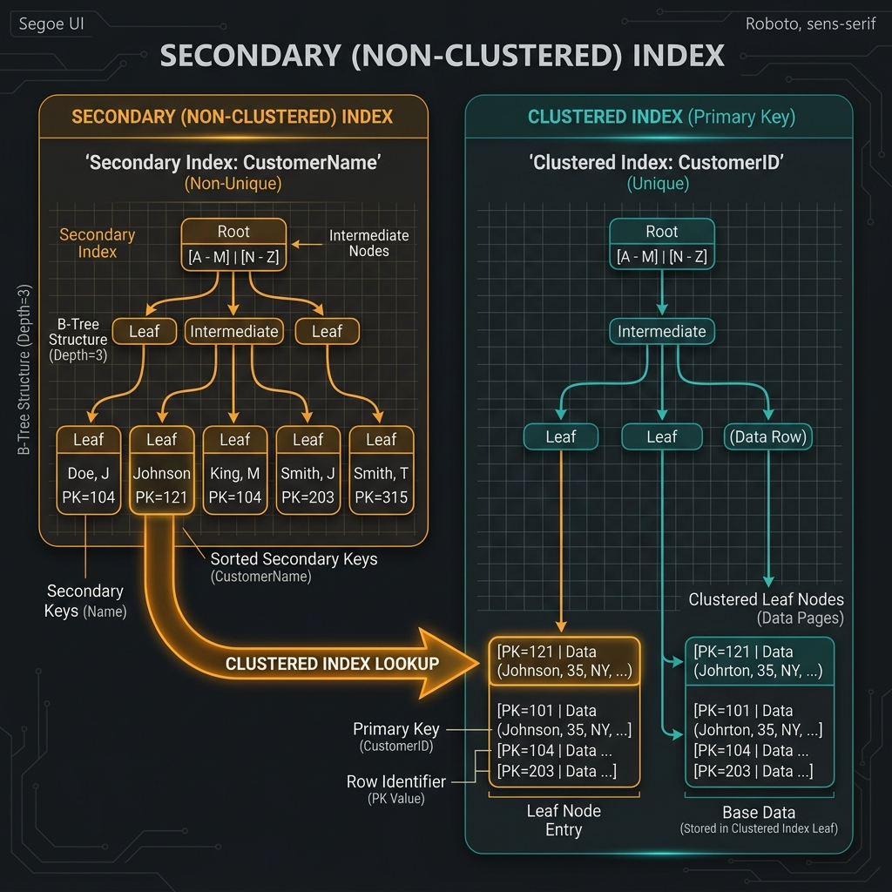

# Clustered and Secondary Indexes in MySQL (InnoDB)

In MySQL, specifically within the **InnoDB** storage engine, indexes are the most critical factor for query performance. Understanding the difference between **Clustered** and **Secondary** indexes is essential for designing efficient database schemas.

---

## 1. Clustered Index

The **Clustered Index** is a special type of index that determines the physical order of data in a table. In InnoDB, the clustered index **is** the table; the leaf nodes of the B-Tree contain the actual row data.

### How InnoDB Selects the Clustered Index:
1.  **Primary Key**: If you define a `PRIMARY KEY`, InnoDB uses it as the clustered index.
2.  **Unique NOT NULL Index**: If no `PRIMARY KEY` is defined, InnoDB uses the first `UNIQUE` index where all columns are `NOT NULL`.
3.  **Hidden Row ID**: If neither exists, InnoDB generates a hidden clustered index named `GEN_CLUST_INDEX` on a synthetic 6-byte column (Row ID).

### Visual Reference: Clustered Index Structure
The following diagram illustrates how a Clustered Index stores full data rows at its leaf level.



> [!TIP]
> **Performance Note**: Accessing a row through the clustered index is extremely fast because the index search leads directly to the page containing the row data, saving a disk I/O operation.

---

## 2. Secondary (Non-Clustered) Index

All indexes other than the clustered index are known as **Secondary Indexes**. In InnoDB, each record in a secondary index contains the indexed columns **plus the Primary Key value** of the corresponding row.

### How it Works:
1.  InnoDB searches the secondary index for the indexed value.
2.  Once found, it retrieves the **Primary Key** stored at the leaf node.
3.  It then performs a **Clustered Index Lookup** (Bookmark Lookup) using that Primary Key to find the actual data row.

### Visual Reference: Secondary Index Relationship
The diagram below shows how a secondary index (e.g., on `CustomerName`) points to the Primary Key, which is then used to locate the full row in the Clustered Index.



> [!IMPORTANT]
> If your Primary Key is long (e.g., a long string), every secondary index will also become larger because it must store the PK. Always prefer short, stable Primary Keys (like integers or UUIDs).

---

## 3. Comparison Table

Based on GeeksforGeeks and MySQL documentation:

| Feature | Clustered Index | Secondary (Non-Clustered) Index |
| :--- | :--- | :--- |
| **Data Storage** | Leaf nodes contain the **actual data rows**. | Leaf nodes contain **indexed values + PK pointers**. |
| **Quantity** | Only **one** per table. | **Multiple** allowed per table. |
| **Physical Order** | Defines the physical order of rows on disk. | Does not affect the physical order of rows. |
| **Search Speed** | Faster (direct access to data). | Slower (requires an extra lookup in the clustered index). |
| **Key Selection** | Primary Key (by default). | Any column(s) specified by the user. |

---

## 4. Practical SQL Examples

### Creating a Clustered Index (via Primary Key)
```sql
CREATE TABLE Students (
    StudentID INT PRIMARY KEY,  -- This becomes the Clustered Index
    Name VARCHAR(100),
    Email VARCHAR(100) UNIQUE,  -- A unique index
    EnrollmentDate DATE
);
```

### Adding a Secondary Index
```sql
-- Creating a secondary index on the 'Name' column
CREATE INDEX idx_student_name ON Students(Name);
```

### Checking Index Usage
You can see which index MySQL is using by prefixing your query with `EXPLAIN`:
```sql
EXPLAIN SELECT * FROM Students WHERE Name = 'Alice';
```

---

## Summary for Learning
- **Clustered Index = The Table Data**. It's the "Main Index".
- **Secondary Index = A reference to the PK**. It's a "Helper Index".
- **Rule of Thumb**: Always define a Primary Key. It makes your table organized and allows secondary indexes to function efficiently.

---
*References:*
- [MySQL 8.4 Documentation: Clustered and Secondary Indexes](https://dev.mysql.com/doc/refman/8.4/en/innodb-index-types.html)
- [GeeksforGeeks: Clustered and Non-Clustered Indexing](https://www.geeksforgeeks.org/sql/clustered-and-non-clustered-indexing/)
