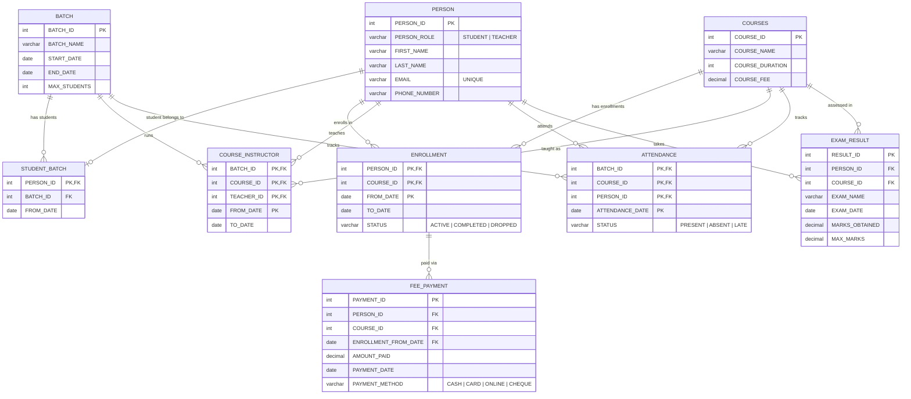

# Coaching Center — ER Diagram

ER diagram for the schema defined in [CoachingCenter.sql](CoachingCenter.sql). Rendered with Mermaid (GitHub renders this natively).

## Notes

- `PERSON` is a single table for both roles (`STUDENT` / `TEACHER`), distinguished by `PERSON_ROLE`. The diagram shows it linked from both the student-side tables (`STUDENT_BATCH`, `ENROLLMENT`, `ATTENDANCE`, `EXAM_RESULT`) and the teacher-side table (`COURSE_INSTRUCTOR`) — these are the same physical table, not two entities.
- `STUDENT_BATCH.PERSON_ID` is the primary key (not part of a composite key), which structurally enforces the rule that **a student belongs to exactly one batch**.
- `ENROLLMENT` and `COURSE_INSTRUCTOR` are many-to-many(-to-many) junction tables, which is how **a student enrolls in multiple courses** and **a teacher teaches multiple courses across multiple batches** are both represented.
- `FEE_PAYMENT` references `ENROLLMENT`'s composite key (`PERSON_ID`, `COURSE_ID`, `FROM_DATE`), so a payment is always tied to a specific enrollment period, not just a student/course pair in the abstract.
