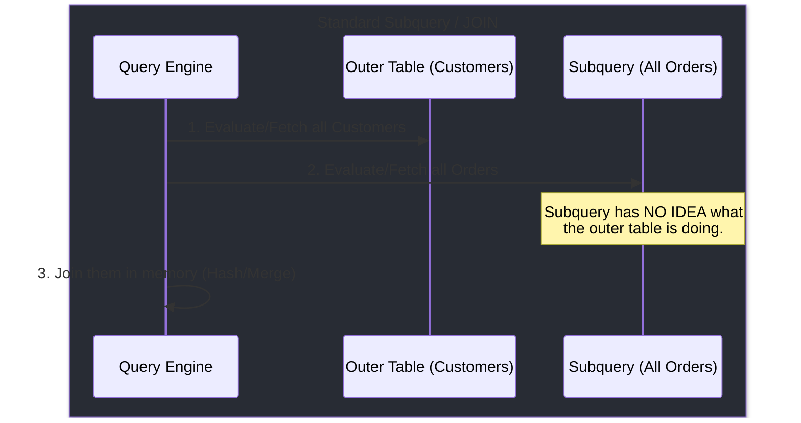
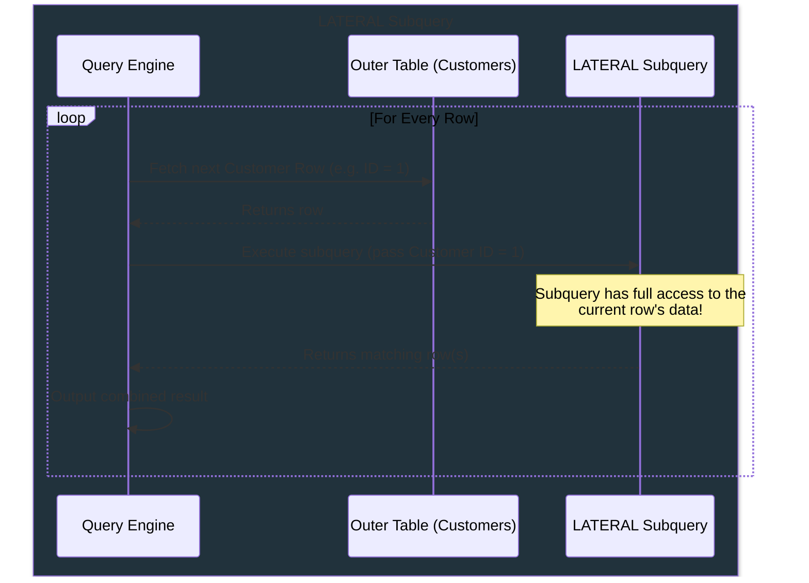

# Understanding LATERAL Subqueries in SQL

A **LATERAL** subquery (sometimes called a `LATERAL JOIN` or, in SQL Server, `CROSS APPLY`) is a powerful SQL feature that fundamentally changes how subqueries behave in the `FROM` clause.

Normally, a subquery in the `FROM` clause is completely independent. It executes first, generates a virtual table, and then the outer query joins against it.

The `LATERAL` keyword changes this: it acts like a **`For-Each` loop** in SQL. It allows the subquery to "see" and use values from tables that were defined *before* it in the same `FROM` clause.

## 1. Visualizing the Execution Flow

To really understand `LATERAL`, it helps to see how the database execution engine treats it compared to a standard Join/Subquery.

### Standard Subquery / JOIN



### LATERAL Subquery


## 2. A Practical Example: "The Top N Per Category" Problem

The most famous use case for `LATERAL` is finding the "top N items per category", such as the **3 most recent orders for EVERY customer**.

Without `LATERAL`, you generally have to use complex Window Functions (`ROW_NUMBER() OVER (...)`) and a CTE/Subquery to filter the rows after the fact.

With `LATERAL`, you simply say for *each* customer, go find their top 3 orders:

```sql
SELECT 
    c.customer_name,
    recent_orders.order_date,
    recent_orders.total_amount
FROM 
    customers c,
    -- LATERAL explicitly lets this subquery reference "c.customer_id"
    LATERAL (
        SELECT order_date, total_amount
        FROM orders o
        WHERE o.customer_id = c.customer_id -- 👈 Look! It's referencing the outer table
        ORDER BY o.order_date DESC
        LIMIT 3
    ) AS recent_orders;
```

> **Tip:**
> In PostgreSQL and MySQL 8.0+, you use `LATERAL`. In SQL Server, the exact same concept is written as `CROSS APPLY`.

## 3. How is LATERAL different from Correlated Subqueries?

This is the most common point of confusion! Both "For-Each" execution and referencing outer tables sound exactly like **Correlated Subqueries**. 

While they use the same underlying engine mechanics, their **purpose and output capabilities** are very different:

| Feature | Correlated Subquery | LATERAL Subquery |
| :--- | :--- | :--- |
| **Where is it used?** | `SELECT`, `WHERE`, `HAVING` clauses. | `FROM` clause (as a data source/join). |
| **What can it return?** | Strictly a **single value** (1 column, 1 row) or a boolean (`EXISTS`). | **Multiple rows and multiple columns**! |
| **Primary Use Case** | Checking for existence (`WHERE EXISTS`), or pulling a single aggregate value (e.g., "Total Order Count"). | Extracting complex, multi-column subsets of data per row (e.g., "The Top 3 Orders with their Date and Amount"). |

**In short:** A correlated subquery is like asking a simple yes/no question or asking for a single number. A LATERAL subquery is like asking for a complete, detailed report (multiple columns/rows) tailored specifically for each member of the outer table.

## 4. Why is LATERAL so useful?

1. **Calculating functions on the fly**: If you have a table storing raw JSON, you can use a LATERAL subquery to parse / transform that JSON into multiple localized rows, and then join those back to the original row.
2. **"Top N per category"**: As shown above, calculating limited result sets per associated foreign key.
3. **Performance**: In scenarios involving heavily indexed tables, it can be much faster for the engine to execute index-lookups row-by-row (using LATERAL) than to aggregate/sort the entire massive `orders` table in memory just to discard 99% of it.

## 4. Great References for Further Reading

If you want to dive deeper into this topic over a cup of coffee, here are the absolute best industry resources and tutorials explaining `LATERAL`:

1. **[Crunchy Data: What is a PostgreSQL LATERAL JOIN?](https://www.crunchydata.com/blog/what-is-a-postgresql-lateral-join)**
   *A fantastic, highly readable tutorial that steps through practical use-cases with great PostgreSQL examples.*
2. **[Modern-SQL: LATERAL](https://modern-sql.com/feature/lateral)**
   *Markus Winand, the SQL master behind "Use The Index, Luke," thoroughly explains LATERAL, giving its background relative to the SQL Standard and how it replaces tedious queries.*
3. **[PostgreSQL Official Docs: LATERAL Subqueries](https://www.postgresql.org/docs/current/queries-table-expressions.html#QUERIES-LATERAL)**
   *The definitive guide. Short, to the point, and strictly defines what scoping is available inside a `LATERAL` clause.*
4. **[Baeldung: Guide to LATERAL Joins in SQL](https://www.baeldung.com/sql/lateral-joins)**
   *A more comparative look that contrasts LATERAL across different RDBMS dialects (like SQL Server's CROSS APPLY).*
